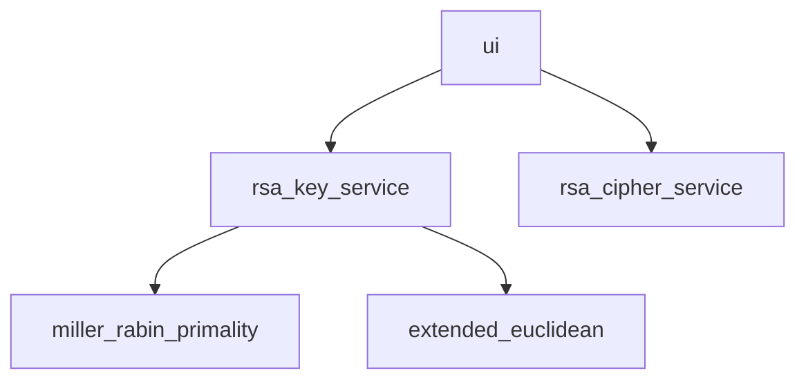

# Implementation

## Structure

- User interacts with the application throught graphical user interface
- Project is separated to three parts: ui, services and algorithms

### UI

Contains project's graphical user interface. Consists of three views: key_generation, encryption and decryption.

### Services

Contains services for project's different functionalities.

- rsa_key_service: responsible for RSA key-pair creation
- rsa_cipher_service: responsible for message encrypt/decrypt operations

### Algorithms

Contains longer algorithms required for rsa key creation.
- miller_rabin_primality: test whether a given number is likely to be a prime
- extended_euclidean: calculates the greatest common divisor and coefficients of Bézout's identity

## Performance

The RSA key creation part of this app works by randomly generating large, 1024-bit numbers. If this number is odd, it's tested for primality using Miller-Rabin primality test. Due to random element, this process needs to be executed multiple times, until a prime is found. Whole key-pair creation takes 1 to 10 seconds.
Encryption/decryption works more or less instantly.

### Miller-Rabin primality test
Maximum of 40 rounds of testing is executed for each given number. Algorithm uses repeated squaring algorithm which puts time complexity to O(k log3 n), where n is the number tested for primality and k is the number of rounds performed. Time complecity taken from pseudocode, which can be found [here](https://en.wikipedia.org/wiki/Miller%E2%80%93Rabin_primality_test)

### Extended Euclidean algorithm
This algorithm calculates coefficients of Bézout's identity with no additional cost when compared to Euclidean algorithm. Time complexity is O(log(min(a, b))).
Time complecity taken from pseudocode, which can be found [here](https://en.wikipedia.org/wiki/Extended_Euclidean_algorithm)

## LLMs
Large language models were not used during creation of this project.

## Possible improvements
- Key creation could be faster with prime number pre-testing before full Miller-Rabin test
- Miller-Rabin can be paired with FFT-based multiplication, making calculations faster
- Padding could be added during encryption making it more secure

## Sources

- [RSA (cryptosystems)](https://en.wikipedia.org/wiki/RSA_(cryptosystem)), Wikipedia 2023
- [Miller-Rabin primality test](https://en.wikipedia.org/wiki/Miller%E2%80%93Rabin_primality_test), Wikipedia 2023
- [Extended Euclidean algorithm](https://en.wikipedia.org/wiki/Extended_Euclidean_algorithm), Wikipedia 2023
- [Lecture 12: The RSA Cryptosystem and Efficient Exponentiation by Christof Paar](https://www.youtube.com/watch?v=QSlWzKNbKrU), Christof Paar 2014
